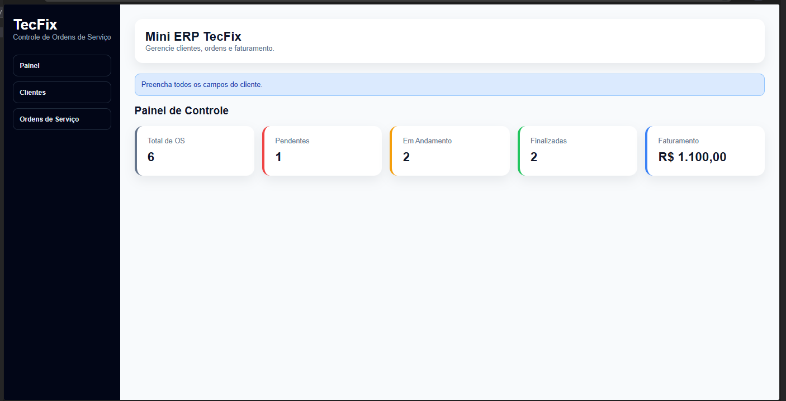
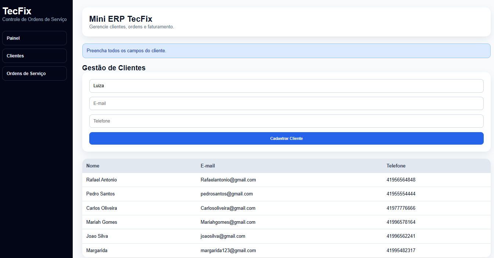
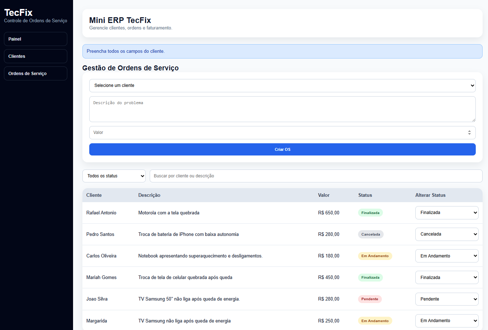
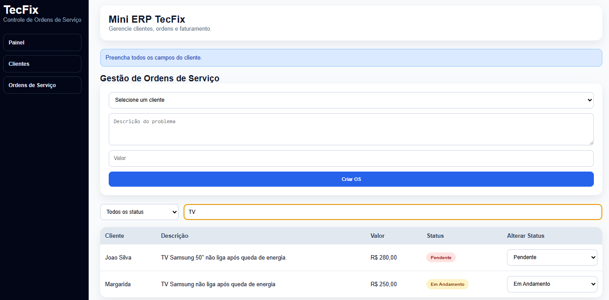

# 🛠️ TecFix - Sistema de Controle de Ordens de Serviço


## 🌐 Demonstração

🔗 Projeto Online: https://teste-fullstack-junior-tecfix.vercel.app

---

## 📖 Sobre o Projeto

O TecFix é um sistema web desenvolvido para gerenciar clientes e ordens de serviço de uma assistência técnica de eletrônicos.

Este projeto foi desenvolvido como teste técnico para uma vaga de Desenvolvedor Júnior Full Stack, utilizando React JS e Supabase.

O sistema permite o gerenciamento completo de clientes e ordens de serviço, oferecendo recursos de busca, filtros, atualização de status e acompanhamento dos atendimentos realizados.

---

## 🎯 Objetivo do Projeto

Desenvolver uma aplicação Full Stack para gerenciamento de clientes e ordens de serviço, utilizando React no frontend e Supabase como backend e banco de dados.

O projeto foi criado para demonstrar conhecimentos em:

* React
* JavaScript
* PostgreSQL
* Integração com APIs
* Operações CRUD
* Boas práticas de desenvolvimento

---

## 🚀 Tecnologias Utilizadas

### Frontend

* React JS
* Vite
* JavaScript
* CSS3

### Backend

* Supabase

### Banco de Dados

* PostgreSQL

### Deploy

* Vercel

---

## ✨ Funcionalidades

### 📊 Dashboard

✅ Total de Ordens de Serviço

✅ Quantidade de OS por status

✅ Faturamento total das OS finalizadas

### 👥 Gestão de Clientes

✅ Cadastro de clientes

✅ Listagem de clientes

✅ Edição de clientes

✅ Validação de campos obrigatórios

✅ Validação de e-mail

### 🛠️ Gestão de Ordens de Serviço

✅ Criação de novas OS

✅ Associação da OS a um cliente

✅ Status inicial como "Pendente"

✅ Atualização de status

✅ Listagem de ordens de serviço

✅ Filtro por status

✅ Busca por cliente ou descrição

✅ Exibição de valores formatados em Real (R$)

---

## 📸 Screenshots

### Dashboard



### Clientes



### Ordens de Serviço



### Busca e Filtros



---

## 🌟 Destaques do Projeto

* CRUD completo de clientes
* CRUD completo de ordens de serviço
* Integração com Supabase
* Dashboard com indicadores
* Busca e filtros dinâmicos
* Relacionamento entre tabelas
* Validação de formulários
* Deploy em produção com Vercel

---

## 🏗️ Estrutura do Projeto

```txt
src/
├── assets/
├── App.jsx
├── App.css
├── index.css
├── main.jsx
└── supabaseClient.js
```

---

## 🗄️ Estrutura do Banco de Dados

### Tabela: clientes

| Campo      | Tipo      |
| ---------- | --------- |
| id         | bigint    |
| nome       | text      |
| email      | text      |
| telefone   | text      |
| created_at | timestamp |

### Tabela: ordens_servico

| Campo      | Tipo      |
| ---------- | --------- |
| id         | bigint    |
| cliente_id | bigint    |
| descricao  | text      |
| valor      | numeric   |
| status     | text      |
| created_at | timestamp |

---

## ⚙️ Como Executar o Projeto

### Instalar dependências

```bash
npm install
```

### Configurar variáveis de ambiente

Criar um arquivo `.env` na raiz do projeto:

```env
VITE_SUPABASE_URL=SEU_SUPABASE_URL
VITE_SUPABASE_ANON_KEY=SUA_SUPABASE_ANON_KEY
```

⚠️ Nunca compartilhe suas chaves reais no GitHub.

### Executar aplicação

```bash
npm run dev
```

---

## 💾 Script SQL

```sql
create table clientes (
  id bigint generated always as identity primary key,
  nome text not null,
  email text not null,
  telefone text not null,
  created_at timestamp default now()
);

create table ordens_servico (
  id bigint generated always as identity primary key,
  cliente_id bigint references clientes(id),
  descricao text not null,
  valor numeric(10,2) not null,
  status text default 'Pendente',
  created_at timestamp default now()
);
```

---

## 📚 Aprendizados

Durante o desenvolvimento deste projeto foram aplicados conceitos de:

* Componentização em React
* Gerenciamento de estado
* Integração com banco de dados
* Operações CRUD
* Validação de formulários
* Filtros e buscas
* Manipulação de dados
* Organização de código
* Responsividade
* Deploy de aplicações web

---

## 🔮 Melhorias Futuras

* Autenticação de usuários
* Dashboard com gráficos
* Relatórios em PDF
* Histórico de alterações
* Notificações automáticas
* Paginação de registros

---

## 👩‍💻 Desenvolvido por

**Giully Fiorin**

Estudante de Análise e Desenvolvimento de Sistemas pela Uninter, com foco em desenvolvimento Full Stack utilizando React, JavaScript, Supabase e PostgreSQL.

📌 Projeto desenvolvido como desafio técnico para demonstrar conhecimentos em React, banco de dados, integração com APIs e operações CRUD.
